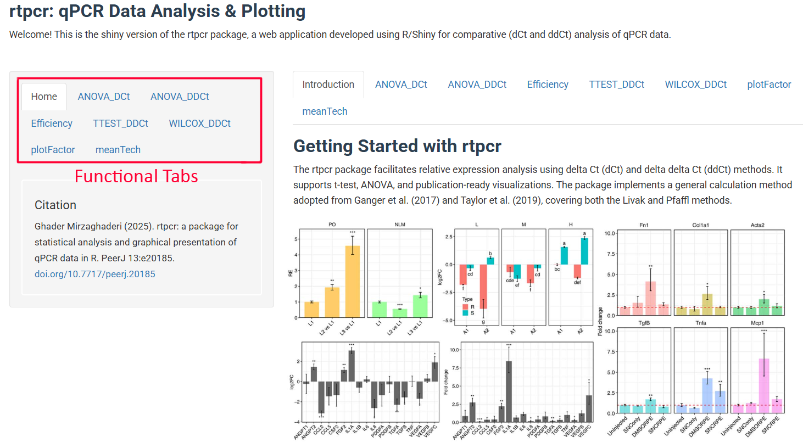
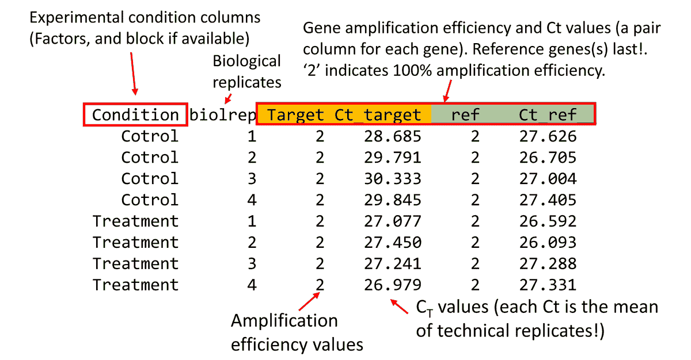
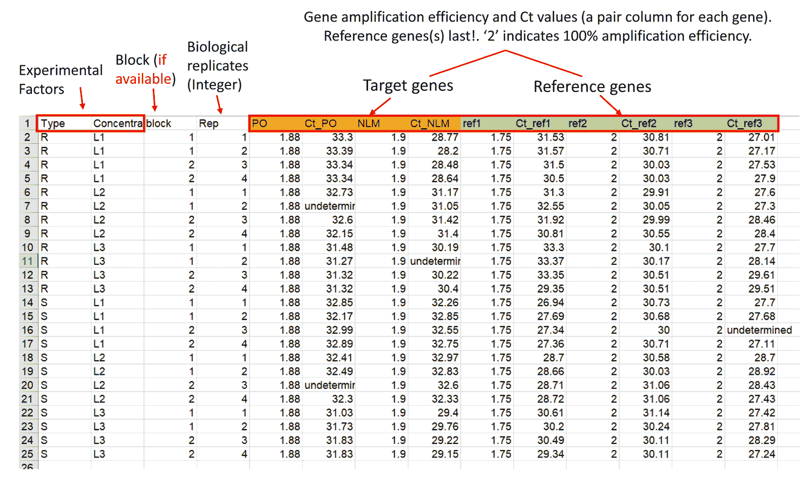
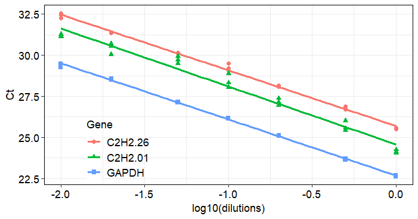
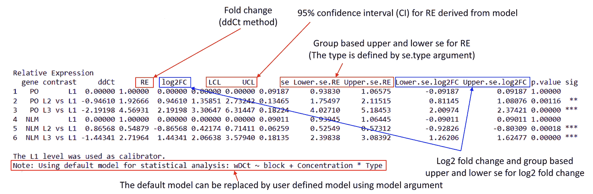
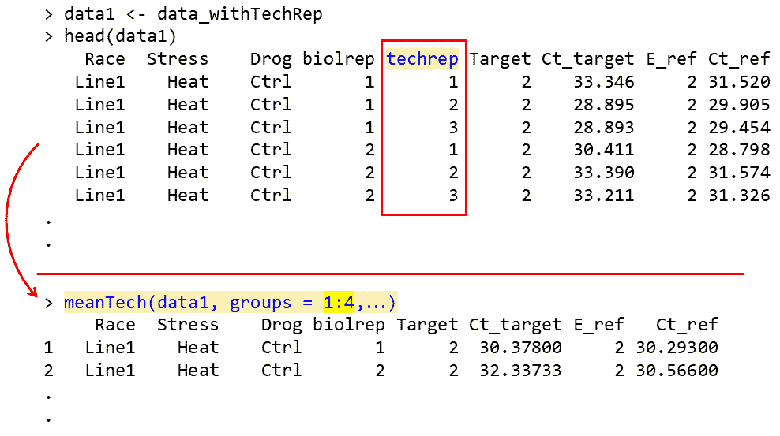

<!-- README.md is generated from README.Rmd. Please edit that file -->

# shiny_rtpcr 


the shiny_rtpcr tool is an interactive graphical user interface from the rtpcr package that is used for efficiency-weighted relative expression analysis using both the delta Ct (dCt) and delta delta Ct (ddCt) methods, accommodating parametric and non-parametric statistics alongside linear mixed-effect models. The application performs technical replicate averaging, primer efficiency calculation, and multi-factor ANOVA and mixed-effects modeling. shiny_rtpcr also generates publication-ready barplots. shiny_rtpcr is available at https://mirzaghaderi.shinyapps.io/rtpcr/.


<figure>

<figcaption aria-hidden="true">Figure 1: rtpcr is now available as
shiny_rtpcr, a web application developed using R/Shiny for interactive
analysis of qPCR data at <a
href="https://mirzaghaderi.shinyapps.io/rtpcr/"
class="uri">https://mirzaghaderi.shinyapps.io/rtpcr/</a></figcaption>
</figure>


# Running the shiny_rtpcr offline 

If you have problem with connecting to https://mirzaghaderi.shinyapps.io/rtpcr/, follow these steps in Rstudio to run the shiny_rtpcr offline.

```{r eval= F}
install.packages("rtpcr")
install.packages("shiny")
library(shiny)
library(rtpcr)
# Run the following code in Rstudio
runApp(system.file("shinyapp/app.R", package = "rtpcr"))
```


#  Functional tabs
In the shiny_rtpcr tool, tabs with _DDCt at the end of their name (`ANOVA_DDCt`, `TTEST_DDCt`, `WILCOX_DDCt`) perform delta delta Ct (ddCt) expression analysis, while `ANOVA_DCt` analyze gene expression using the delta Ct (dCt) method. The ANOVA prefix indicates that the function uses analysis of variance (using a default full factorial model or a user defined model) for statistical analysis, and mean comparisons. 

| Tabs            | Description                                                  |
|---------------------|--------------------------------------------------------------|
| `ANOVA_DCt`     | dCt expression analysis for all the level combinations of factor(s). |
| `ANOVA_DDCt`    | ddCt expression analysis for levels of a factor (generally or per levels of another factors(s)), specified by the `specs` argument.  |
| `TTEST_DDCt`    | ddCt method *t*.test analysis for paired or unpaired samples. |
| `WILCOX_DDCt`         | ddCt method wilcox.test analysis for paired or unpaired samples.    |
| `plotFactor`        | Bar plot of gene expression for one-, two- or three-factor experiments
| `efficiency`        | Amplification efficiency statistics and standard curves     |
| `meanTech`          | Calculate mean of technical replicates. This is used if your data needs averaging over biological replicates.     |
| `multiplot`         | Combine multiple ggplot objects into a single layout   |


# Input data structure 

Input data should be in csv format. For relative expression analysis using `TTEST_DDCt`, `WILCOX_DDCt`, `ANOVA_DCt`, and `ANOVA_DDCt` tabs, the input data table should include the following columns from left to wright:


1.  Experimental condition columns (and one block if available [NOTE 1](#note-1))
2.  Replicates information (biological replicates or subjects; see [NOTE 2](#note-2), and [NOTE 3](#note-3))  
3.  Target genes efficiency and Ct values (a pair column for each gene).
4.  Reference genes efficiency and Ct values (a pair column for each gene).

Each functional tab include a sample data that if clicked, appropriate argument values is automatically entered. The tool supports **one or more target or reference gene(s)**, supplied as efficiency–Ct column pairs. Reference gene columns must always appear last. Two sample input data sets are presented below. Complete amplification efficiency (E) in the input data is denoted by 2. This means that 2 indicates 100%, and 1.85 and 1.70 indicate 0.85% and 0.70% amplification efficiencies.


<figure>

<figcaption aria-hidden="true">Figure 2: A sample input data with one
experimental factor, replicate column and E/Ct information of target and
reference genes</figcaption>
</figure>


<br>


If there is no blocking factor, the block column should be omitted. However, a column for biological replicates (which may be named "Rep", "id" or similar) is always required.


<br>


<figure>

<figcaption aria-hidden="true">Figure 3: A sample input data with two
experimetal factors, blocking factor, replicate column and E/Ct
information of target and reference genes</figcaption>
</figure>


#### NOTE 1

When a qPCR experiment is done in multiple qPCR plates, conduct each plate as a randomized block
so that at least one replicate of each treatment and control is present on each plate. Block effect is usually considered as random and its
interaction with any main effect is not considered.

#### NOTE 2

For `TTEST_DDCt` and `WILCOX_DDCt` (independent groups),
`ANOVA_DCt`, and `ANOVA_DDCt` each row in the input table is from a separate and unique
biological replicate. For example, a data frame with 12 rows has come
from an experiment with 12 individuals. The repeated measure models are
intended for experiments with repeated observations (e.g. time-course
data). In repeated measure experiments the replicate column contains
identifiers for each individual (id or subject). For example, all rows
with a `r1` at Rep column correspond to a single individual, all rows
with a `r2` correspond to another individual, and so on, which have been
sampled at specific time points.

#### NOTE 3

Your data table may also include a column of technical replicates. in this case, the technical replicate column should be located immediately after the biological replicate column. In this case, the `meanTech` tab should be applied first to calculate the mean of the technical replicates. The resulting collapsed table is then used as the input for expression analysis. see the samople data in the `meanTech` tab.

<figure>

<figcaption aria-hidden="true">Figure 4: An experimental design with
four biological replicates for both Control and Treatment conditions,
assuming a single sampling time point, where cDNA samples were analyzed
by qPCR. The diagram details the initial dataset containing technical
replicates. Three technical replicates shown for biological replicate 1
under Control, with example amplification efficiencies (E) and cycle
threshold (Ct) values for both target and reference genes. Technical
replicates is averaged to get a condensed dataset, comprising eight rows
(one per biological replicate). This final data structure is used for
the downstream relative expression analysis. Green and yellow circles
are control samples.</figcaption>
</figure>

# Handling missing data

Missing Ct values for target genes are handled using the
`set_missing_target_Ct_to_40` argument. If `TRUE`, missing target gene
Ct values become 40; if `FALSE` (default), they become NA. missing Ct
values of reference genes are always converted to NA. If there are more
than one reference gene, NA in the place of the E or the Ct value of
cause skipping that gene and remaining references are geometrically
averaged in that replicate.

# Data Analysis

### Amplification Efficiency

The `efficiency` tab calculates the amplification efficiency (E),
slope, and R² statistics for genes, and performs pairwise comparisons of
slopes. It takes a data frame in which the first column contains the
dilution ratios, followed by the Ct value columns for each gene.


<figure>

<figcaption aria-hidden="true">Figure 5: Standard curve plot displaying
the relationship between the logarithm of cDNA dilution factors (ranging
from -2.0 to 0.0) and their corresponding qPCR cycle threshold (Ct)
values for three genes: C2H2.26, C2H2.01, and GAPDH. The accompanying
table provides the precise Ct measurements, which is used to determine
the amplification efficiency for each gene</figcaption>
</figure>

### Relative expression

**Single factor experiment with two levels (e.g. Control and
Treatment):** `TTEST_DDCt` function is used for relative expression
analysis in treatment condition compared to the control group. Both
paired and unpaired experimental designs are supported. if the data
doesn’t follow t.test assumptions, the `WILCOX_DDCt()` function can be used instead.

**Single- or multi-factor experiments:** In these cases, `ANOVA_DDCt` and `ANOVA_DCt` tabs are used. By
default, statistical analysis is performed based on uni- or multi-factorial Completely Randomized Design (CRD) or Randomized
Complete Block Design (RCBD) design based on `numOfFactors` and the
availability of `block`. However, optional custom model formula as a
character string (see table below) can be supplied to these functions. If provided, this
overrides the default formula (full factorial CRD or RCBD design). The
formula uses `wDCt` as the response variable (wDCt is automatically
created by the function). For mixed models, include random effects using
`lmer` syntax (e.g., `wDCt ~ Treatment + (1 | id)`). Below are a sample
of most common models that can be used.

| Example models may be used in `ANOVA_DCt` or `ANOVA_DDCt` tabs | Experimental design |
|----|----|
| wDCt ~ Condition | Completely Randomized Design (CRD). Can also be used for t.test with two independent groups. (**default**) |
| wDCt ~ Factor1 \* Factor2 \* Factor3 | Factorial under Completely Randomized Design (RCBD) (**default**) |
| wDCt ~ block + Factor1 \* Factor2 | Factorial under Randomized Complete Block Design (**default**) |
| wDCt ~ time + (1 \| id) | Repeated measure analysis: different time points. Also can be used for t.test with two paired groups. |
| wDCt ~ Condition \* time + (1 \| id) | Repeated measure analysis: split-plot in time |
| wDCt ~ Condition \* time + (1 \| block) + (1 \| id) | Repeated measure analysis: split-plot in time |
| wDCt ~ Type + Concentration | Analysis of Covariance (ANCOVA): e.g.: Type could be covariate |
| wDCt ~ block + Type + Concentration | ANCOVA with blocking factor: e.g.: block and Type could be covariates |

#### NOTE

By default, data are analyzed according to a full factorial CRD (if
there is no blocking factor) or RCBD (if there is a blocking factor)
model, so you do not need to explicitly define a model. The package
automatically selects an appropriate model based on the provided
arguments. If no model is specified, the default used model is printed
along with the output expression table.

#### NOTE

Sometime groups are paired (e.g., in repeated measure experiments).
Examples: 1) Analyzing gene expression in different time points, or
before and after treatment in each biological replicate; 2) Analyzing
gene expression between two tissue types within the same organism. For
such analysis types, if there are only two levels or time points, we can
use the `TTEST_DDCt()` with the argument `paired = TRUE`; or
`ANOVA_DDCt()` (if there are two or more time points) with a repeated
measure model such as `wDCt ~ Treatment + ( 1 | id)` or
`wDCt ~ Treatment + ( 1 | Rep)`.

<figure>

<figcaption aria-hidden="true">Figure 6: A) Basic structure of
independent group- or paired group-experiments. Data of paired
group-experiments are analysed using the <code>TTEST_DDCt()</code>
function with the argument paired = TRUE; or using the
<code>ANOVA_DDCt()</code> function with a repeated measure model such as
<code>wDCt ~ Treatment + ( 1 | Rep)</code>. B) The standard error
(<code>se</code>) in the <code>ANOVA_DDCt()</code> function is
calculated from from weighted delta Ct (wDCt) values or model residuals
(default, <code>modelBased_se = TRUE</code>) for the experimental groups
according to the selected <code>se.type</code> (One of
<code>paired.group</code>, <code>two.group</code>, or
<code>single.group</code>). Note that in the <code>paired.group</code>
method,<code>se</code> is computed from differences (wddCt or equivalent
values from residuals) which resembles the standard error of a paired
t.test, while <code>two.group</code> and <code>single.group</code>
methods use wdCt or resudual values. In the <code>two.group</code>
method, <code>se</code> is computed for each non-reference group from
that group and the reference (calibrator) group which resembles the
standard error of an unpaired t.test. <code>single.group</code> computes
<code>se</code> within each reference or non-reference group. If a model
for a repeated‐measure or a paired-group design is specified,
<code>se.type</code> should be set to <code>paired.group</code> in the
<code>ANOVA_DDCt()</code> function. In method 4, the 95% confidence
interval (CI) is calculated and printed in the output expression table
under LCL and UCL columns. CI uses the pooled standard error (SE) and
can be used as another way of error presentation. It can be used for any
experimental models as it is derived from a fitted model. The calculated
<code>se</code> in the <code>TTEST_DDCt()</code> and
<code>WILCOX_DDCt()</code> functions is <code>two.group</code> or
<code>paired.group</code> for unpaired and paired groups, respectively,
and <code>single.group</code> is not available in these
functions.</figcaption>
</figure>

<br>


# Output

## Data output

All the tab functions for relative expression analysis (including
`TTEST_DDCt`, `WILCOX_DDCt`, `ANOVA_DDCt`, and `ANOVA_DCt`)
return the relative expression table which include fold change and
corresponding statistics. The output of `ANOVA_DDCt`, and
`ANOVA_DCt` also include lm model, residuals, raw data and ANOVA table
for each gene.


<figure>

<figcaption aria-hidden="true">Figure 7: All the functions for
relative expression analysis (including <code>TTEST_DDCt</code>,
<code>WILCOX_DDCt</code>, <code>ANOVA_DDCt</code>, and
<code>ANOVA_DCt</code>) return the relative expression table which
include fold change and corresponding statistics. The output of
<code>ANOVA_DDCt</code>, and <code>ANOVA_DCt</code> also include lm
model, residuals, raw data and ANOVA table for each gene.</figcaption>
</figure>


# How to edit output plots?

The plot can further be edited by adding new layers (see examples
below):

| Task | Example Code |
|----|----|
| Change y-axis label | `p + ylab("Relative expression ($\Delta\Delta Ct$ method)")` |
| Add a horizontal reference line | `p + geom_hline(yintercept = 0, linetype = "dashed")` |
| Change y-axis limits | `p + scale_y_continuous(expand = expansion(mult = c(0, 0.1)))` |
| Relabel x-axis | `p + scale_x_discrete(labels = c("A" = "Control", "B" = "Treatment"))` |
| Change fill colors | `p + scale_fill_brewer(palette = "Set2")` |
| number of facets per row | `p + facet_wrap(~ A, ncol = 4)` |
| x.axis line width | `p + theme(axis.line.x = element_line(linewidth = 0))` |
| y.axis line width | `p + theme(axis.line.y = element_line(linewidth = 0))` |
| panel line width | `theme(panel.border = element_rect(color = "black", linewidth = 1))` |


# Checking normality of residuals

If the residuals from a `t.test` or an `lm` object are not normally
distributed, the significance results might be violated. In such cases,
non-parametric tests can be used. For example, the Mann–Whitney test -
also known as the Wilcoxon rank-sum test, (implemented via
`WILCOX_DDCt` tab), is an alternative to t.test, and
`kruskal.test` is an alternative to one-way analysis of variance.
These tests assess differences between population medians using
independent groups. However, the rtpcr `TTEST_DDCt` tab includes
the `var.equal` argument. When set to `FALSE`, performs `t.test` under
the unequal variances hypothesis. Residuals from `ANOVA_DCt` and
`ANOVA_DDCt` tabs can observed in the output for each analysed gene.


# Mean of technical replicates

Calculating the mean of technical replicates and generating an output
table suitable for subsequent expression analysis can be accomplished
using the `meanTech` tab. The input dataset must follow the
column structure illustrated in the example data below. Columns used for
grouping should be specified in the `groups` argument.


<figure>

<figcaption aria-hidden="true">Figure 11: The mean of technical
replicates can be computed using the <code>meanTech()</code>
function.</figcaption>
</figure>

# Contact

Email: gh.mirzaghaderi at uok.ac.ir

# Citation

To cite the package ‘rtpcr’ in publications, please use:

  Ghader Mirzaghaderi (2025). rtpcr: a package for statistical analysis and graphical
  presentation of qPCR data in R. PeerJ 13:e20185. https://doi.org/10.7717/peerj.20185
